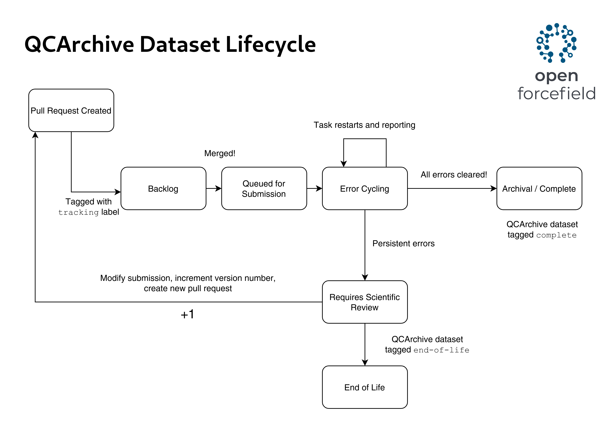

# OpenFF QCArchive Dataset Submission
  
## Dataset Lifecycle

All datasets submitted to QCArchive via this repository conform to the [Dataset Lifecycle](./LIFECYCLE.md).

See [STANDARDS.md](./STANDARDS.md) for submission standards.
Datasets must be submitted as pull requests.

## User Quickstart

0. Ensure `git-lfs` is installed on your local machine: https://git-lfs.github.com/

1. To submit a new dataset, begin by cloning this repository:
   ```
   export GIT_LFS_SKIP_SMUDGE=1
   git clone git@github.com:openforcefield/qca-dataset-submission.git
   ```
   
   This will clone the repo, but avoid downloading existing LFS objects.
   If you wish to download all LFS objects, leave off the `export GIT_LFS_SKIP_SMUDGE=1`.


2. Once cloned, create and switch to a new branch from `master`,
   then create a new directory in `qca-dataset-submission/submissions/`:
   ```
   git checkout -b <dataset-branch>
   mkdir qca-dataset-submission/submissions/YYYY-MM-DD-OpenFF-<DESCRIPTIVE-DATASET-NAME>-v1.0
   ```
   You will add all submission artifacts to this directory.


3. Create and activate a new conda env with basic submission-preparation requirements with:
    ```
    conda env create -f qca-dataset-submission/devtools/prod-envs/qcarchive-user-submit.yaml
    conda activate qcarchive-user-submit
    ```


4. Choose a starting notebook and README based on the type of dataset you wish to submit:
    - [`OptimizationDataset`](./examples/OptimizationDataset/)

   Copy the notebook and README for the dataset you want into the directory you created.

   ```
   cp examples/<dataset-type>/* qca-dataset-submission/submissions/YYYY-MM-DD-OpenFF-<DESCRIPTIVE-DATASET-NAME>-v1.0
   ```


5. Start up a Jupyter notebook with your new notebook:
    ```
    jupyter notebook qca-dataset-submission/submissions/YYYY-MM-DD-OpenFF-<DESCRIPTIVE-DATASET-NAME>-v1.0/generate-dataset.ipynb
    ```
   Edit the contents with appropriate metadata information,
   read in your molecules using the cells appropriate for your input data,
   and make any other modifications as needed for your specific needs.


6. Copy generated metadata components into README.
   Write a reasonably-detailed high-level description of the submission at the top.


7. Commit the following files in the submission directory you made:
    - your input files; please compress them if possible with e.g. `bzip2`
    - `generate-dataset.ipynb`
    - `dataset.pdf`
    - `dataset.smi`
    - `dataset.json.bz2`


8. Push your branch to Github:
    ```
    git push origin <dataset-branch>
    ```


9. Make a new PR for the branch.
   Validation will run automatically on your `dataset.json.*` file, indicating any potential issues prior to submission.
   Ask for help if you see validation failures you do not understand.
   Ping a reviewer in the comments.


10. Once reviewed and approved, your submission will be merged and submitted to QCArchive!
    Computations specified by the submission will be performed on OpenFF-managed compute resources.


# The Lifecycle of a Dataset Submission

All Open Force Field datasets submitted to QCArchive undergo well-defined *lifecycle*.



Each labeled rectangle in the lifecycle represents a *state*. 
A submission PR changes state according to the arrows.
Changes in state may be performed by automation or manually by a human when certain critera are met.

The lifecycle process is described below, with [bracketed] items indicating the agent of action, one of:
- [GHA]: Github Actions
- [Board]: Github Project Board
- [Human]: A maintainer of the `qca-dataset-submission` repository.

1. A PR is created against `qca-dataset-submission` by a submitter.
    - the template is filled out with informational sections according to the [PR template](.github/pull_request_template.md)
    - [GHA]  `validation` operates on all `dataset*.json` files found in the PR; performs validation checks
        - comment made based on validation checks
        - reruns on each push

2. Add card for the PR to [Dataset Tracking](https://github.com/openforcefield/qca-dataset-submission/projects/1) board.
    - [Human]  add 'tracking' tag to PR
    - [GHA]  [`lifecycle-backlog`](.github/workflows/lifecycle-backlog.yml) will add card to ["Backlog"](https://github.com/openforcefield/qca-dataset-submission/projects/1#column-9577334) state for PR if not yet there.

3. When the submission is ready to be submitted to public QCArchive (validations pass, submitters and reviewers satisfied), PR is merged.
    - [Board]  PR card will move to state ["Queued for Submission"](https://github.com/openforcefield/qca-dataset-submission/projects/1#column-9577335) immediately.
    - [GHA]  [`lifecycle-backlog`](.github/workflows/lifecycle-backlog.yml) will move PR card to state ["Queued for Submission"](https://github.com/openforcefield/qca-dataset-submission/projects/1#column-9577335) if merged and in state ["Backlog"](https://github.com/openforcefield/qca-dataset-submission/projects/1#column-9577334)
    - [GHA]  [`lifecycle-submission`](.github/workflows/lifecycle-submission.yml) will attempt to submit the dataset
        - if successful, will move card to state ["Error Cycling"](https://github.com/openforcefield/qca-dataset-submission/projects/1#column-9577365); add comment to PR
        - if failed, will keep card queued; add comment to PR; attempt again next execution 

4. COMPLETE, INCOMPLETE, ERROR numbers reported for `Optimizations`, `TorsionDrives`
    - [GHA]  [`lifecycle-error-cycle`](.github/workflows/lifecycle-error-cycle.yml) will collect the above statistics for state ["Error Cycling"](https://github.com/openforcefield/qca-dataset-submission/projects/1#column-9577365) PRs
        - will restart all errored `Optimizations` and `TorsionDrives`
        - will move PR to state ["Archived/Complete"](https://github.com/openforcefield/qca-dataset-submission/projects/1#column-9577372) if no ERROR, INCOMPLETE, all COMPLETE

5. PR will remain in state ["Error Cycling"](https://github.com/openforcefield/qca-dataset-submission/projects/1#column-9577365) until moved to ["Requires Scientific Review"](https://github.com/openforcefield/qca-dataset-submission/projects/1#column-9577358) or until all tasks COMPLETE
    - [Human]  if errors appear persistent,  move to state ["Requires Scientific Review"](https://github.com/openforcefield/qca-dataset-submission/projects/1#column-9577358)
    - discussion should be had on PR for next version
    - [Human]  once decided, state moved to ["End of Life"](https://github.com/openforcefield/qca-dataset-submission/projects/1#column-9577336)

6. [GHA]  `lifecycle-end-of-life` will add tag 'end-of-life' to dataset in QCArchive for PR in ["End of Life"](https://github.com/openforcefield/qca-dataset-submission/projects/1#column-9577336)

7. [GHA]  `lifecycle-archived-complete` will add tag 'archived-complete' to dataset in QCArchive for PR in ["Archived/Complete"](https://github.com/openforcefield/qca-dataset-submission/projects/1#column-9577372)

## Management Touchpoints

In addition to the states given above, there are additional touchpoints available for managing dataset submissions:

1. The `tracking` label is the "on/off" switch for automation via Github Actions.
   To disable all automation on a submission PR, remove this label.
   To enable automation, add the label.

2. Submission *priority* can be changed by adding one of the following labels:
    - `priority-high`: highest priority
    - `priority-normal`: normal priority
    - `priority-low`: lowest priority

3. Submission routing to QCFractal managers on different compute resources can be accomplished with *compute tags*.
   Add a label like `compute-<tagname>` to set the compute tag for all QCArchive tasks associated with a submisison.
   Be sure to coordinate with QCFractal manager admins to ensure your chosen compute tag is being served on the expected resources.
   This mechanism can also be used to "dead-letter" computations that are no longer desired by setting a compute tag that no manager will service.

4. The order of a submission PR in a [Dataset Tracking](https://github.com/openforcefield/qca-dataset-submission/projects/1) column matters.
   Submissions higher in a column will be operated on first by all Github Action automation.
   For example, if you want to error cycle a submission before any others so it has a higher chance of being pulled by idle manager workers, place it at the top of the Error Cycling column.
   

# Dude where's my Dataset?

Finding the source of a dataset in QCArchive can be difficult; here we offer a mapping between a dataset in QCArchive and the folder which contains its inputs including a quick overview of some metadata and the status of the dataset.
Note that new datasets submitted using QCSubmit know where they were created and have a `long_description_url` in the metadata which points directly to their home folder in this repository.

### Status
The status only refers to the `default` specification which is required for all of our datasets. Currently this is `B3LYP-D3BJ/DZVP`.

### Key:

[](https://img.shields.io/badge/Status-Complete-green) 100% of all default spec jobs have been complete.

[](https://img.shields.io/badge/Status-Error-red)  some of the jobs in the dataset contain errors which may prevent the jobs from finishing, this could be something like a linear torsiondrive.

[](https://img.shields.io/badge/Status-Running-orange)  the dataset is currently running and may have some incomplete jobs.


# Basic Datasets
These are currently used to compute properties of a minimum energy conformation (Hessians, wavefunctions, etc.), usually derived from completed optimization datasets.

| QCArchive Dataset  | Folder  | Description  | Elements  | Status  |
|---|---|---|---|---|
| `OpenFF Optimization Set 1`  | [2019-07-09-OpenFF-Optimization-Set](https://github.com/openforcefield/qca-dataset-submission/tree/master/submissions/2019-07-09-OpenFF-Optimization-Set)  | Hessian calculations. |  Cl, S, C, F, O, H, N  |  [](https://img.shields.io/badge/Status-Complete-green) |
| `OpenFF NCI250K Boron 1` | [2019-07-05 OpenFF NCI250K Boron 1](https://github.com/openforcefield/qca-dataset-submission/tree/master/submissions/2019-07-05%20OpenFF%20NCI250K%20Boron%201) | Hessian calculations. | Cl, Br, S, C, F, B, O, H, N | [](https://img.shields.io/badge/Status-Complete-green) |
| `OpenFF Discrepancy Benchmark 1` | [2019-07-05 eMolecules force field discrepancies 1](https://github.com/openforcefield/qca-dataset-submission/tree/master/submissions/2019-07-05%20eMolecules%20force%20field%20discrepancies%201) | Hessian calculation. | Cl, Br, S, C, F, P, I, O, H, N | [](https://img.shields.io/badge/Status-Error-red) |
| `OpenFF Gen 2 Opt Set 1 Roche` | [2020-03-20-OpenFF-Gen-2-Optimization-Set-1-Roche](https://github.com/openforcefield/qca-dataset-submission/tree/master/submissions/2020-03-20-OpenFF-Gen-2-Optimization-Set-1-Roche) | Hessian calculation. | Cl, S, C, F, O, H, N  |  [](https://img.shields.io/badge/Status-Complete-green) |
| `OpenFF Gen 2 Opt Set 2 Coverage` | [2020-03-20-OpenFF-Gen-2-Optimization-Set-2-Coverage](https://github.com/openforcefield/qca-dataset-submission/tree/master/submissions/2020-03-20-OpenFF-Gen-2-Optimization-Set-2-Coverage) | The hessian calculations. | Cl, Br, S, C, F, P, I, O, H, N | [](https://img.shields.io/badge/Status-Error-red) |
| `OpenFF Gen 2 Opt Set 3 Pfizer Discrepancy` | [2020-03-20-OpenFF-Gen-2-Optimization-Set-3-Pfizer-Discrepancy](https://github.com/openforcefield/qca-dataset-submission/tree/master/submissions/2020-03-20-OpenFF-Gen-2-Optimization-Set-3-Pfizer-Discrepancy) | Hessian calculations. | Cl, F, C, S, O, H, N | [](https://img.shields.io/badge/Status-Complete-green) |
| `OpenFF Gen 2 Opt Set 4 eMolecules Discrepancy` | [2020-03-20-OpenFF-Gen-2-Optimization-Set-4-eMolecules-Discrepancy](https://github.com/openforcefield/qca-dataset-submission/tree/master/submissions/2020-03-20-OpenFF-Gen-2-Optimization-Set-4-eMolecules-Discrepancy) | Hessian calculations. | Cl, Br, S, C, F, P, I, O, H, N |  [](https://img.shields.io/badge/Status-Complete-green) |
| `OpenFF Gen 2 Opt Set 5 Bayer` | [2020-03-20-OpenFF-Gen-2-Optimization-Set-5-Bayer](https://github.com/openforcefield/qca-dataset-submission/tree/master/submissions/2020-03-20-OpenFF-Gen-2-Optimization-Set-5-Bayer) | Hessian calculations. | Si, Cl, Br, F, C, S, O, H, N | [](https://img.shields.io/badge/Status-Error-red) |
| `OpenFF VEHICLe Set 1` | [2019-07-02 VEHICLe optimization dataset](https://github.com/openforcefield/qca-dataset-submission/tree/master/submissions/2019-07-02%20VEHICLe%20optimization%20dataset)  |  Hessian calculations. | S, C, O, H, N  |  [](https://img.shields.io/badge/Status-Error-red)  |
| `SMIRNOFF Coverage Set 1` | [2019-06-25-smirnoff99Frost-coverage](https://github.com/openforcefield/qca-dataset-submission/tree/master/submissions/2019-06-25-smirnoff99Frost-coverage)  | Hessian calculations. |  Cl, Br, S, C, F, P, I, O, H, N |  [](https://img.shields.io/badge/Status-Error-red) |
|`OpenFF ESP Fragment Conformers v1.0` | [2022-01-16-OpenFF-ESP-Fragment-Conformers-v1.0](https://github.com/openforcefield/qca-dataset-submission/tree/master/submissions/) | ESP Calculations | N, Cl, C, H, P, Br, O, F, S |[](https://img.shields.io/badge/Status-Running-orange) |
| `OpenFF Theory Benchmarking Single Point Energies v1.0` | [2021-09-06-theory-bm-single-points](https://github.com/openforcefield/qca-dataset-submission/tree/master/submissions/2021-09-06-theory-bm-single-points)  | Single Point Energy dataset for the final optimized geometries from MP2/heavy-aug-cc-pVTZ torsiondrives. |  Cl, F, C, S, O, H, N, P | [](https://img.shields.io/badge/Status-Running-orange) |
| `TorsionNet500 Single Points Dataset v1.0` | [2021-11-09-TorsionNet500-single-points](https://github.com/openforcefield/qca-dataset-submission/tree/master/submissions/2021-11-09-TorsionNet500-single-points) | Single point energies of final geometries of TorsionNet500 dataset. | H, O, F, S, N, Cl, C | [](https://img.shields.io/badge/Status-Running-orange) |
| `SPICE DES Monomers Single Points Dataset v1.1` | [2021-11-15-QMDataset-DES-monomers-single-points](https://github.com/openforcefield/qca-dataset-submission/tree/master/submissions/2021-11-15-QMDataset-DES-monomers-single-points ) | Single point energy calculation of DES monomers. | I, C, Br, P, Cl, H, S, O, F, N | [](https://img.shields.io/badge/Status-Complete-green) |
| `SPICE Solvated Amino Acids Single Points Dataset v1.1` | [2021-11-08-QMDataset-Solvated-Amino-Acids-single-points]( https://github.com/openforcefield/qca-dataset-submission/tree/master/submissions/2021-11-08-QMDataset-Solvated-Amino-Acids-single-points )  | Single point energy calculation of solvated amino acids. | N, S, O, C, H | [](https://img.shields.io/badge/Status-Complete-green) |
| `SPICE DES370K Single Points Dataset v1.0` | [2021-11-08-QMDataset-DES370K-single-points]( https://github.com//openforcefield/qca-dataset-submission/tree/master/submissions/2021-11-08-QMDataset-DES370K-single-points ) | SPICE single point dataset for ML applications. | 'N', 'O', 'Mg', 'H', 'F', 'K', 'Br', 'Na', 'P', 'Cl', 'I', 'Ca', 'S', 'Li', 'C' | [](https://img.shields.io/badge/Status-Complete-green) |
| `SPICE DES370K Single Points Dataset Supplement v1.0` | [2022-02-18-QMDataset-DES370K-single-points-supplement]( https://github.com//openforcefield/qca-dataset-submission/tree/master/submissions/2022-02-18-QMDataset-DES370K-single-points-supplement ) | SPICE single point dataset for ML applications. | F, H, Cl, S, I, Br, N, Li, O, C, Na | [](https://img.shields.io/badge/Status-Running-orange) |
| `SPICE Dipeptides Single Points Dataset v1.2` | [2021-11-08-QMDataset-Dipeptide-single-points]( https://github.com/openforcefield/qca-dataset-submission/tree/master/submissions/2021-11-08-QMDataset-Dipeptide-single-points )  | SPICE single point dataset for ML applications. | C ,N ,O ,H ,S  | [](https://img.shields.io/badge/Status-Complete-green)  |
| `SPICE PubChem Set 1 Single Points Dataset v1.2` | [2021-11-08-QMDataset-pubchem-set1-single-points]( https://github.com/openforcefield/qca-dataset-submission/tree/master/submissions/2021-11-08-QMDataset-pubchem-set1-single-points )  | SPICE single point dataset for ML applications. | 'O', 'Cl', 'N', 'C', 'P', 'Br', 'S', 'F', 'I', 'H' | [](https://img.shields.io/badge/Status-Running-orange)  |
| `SPICE PubChem Set 2 Single Points Dataset v1.2` | [2021-11-09-QMDataset-pubchem-set2-single-points]( https://github.com/openforcefield/qca-dataset-submission/tree/master/submissions/2021-11-09-QMDataset-pubchem-set2-single-points )  | SPICE single point dataset for ML applications. | 'H', 'P', 'C', 'Cl', 'Br', 'N', 'F', 'S', 'O', 'I' | [](https://img.shields.io/badge/Status-Running-orange)  |
| `SPICE PubChem Set 3 Single Points Dataset v1.2` | [2021-11-09-QMDataset-pubchem-set3-single-points]( https://github.com/openforcefield/qca-dataset-submission/tree/master/submissions/2021-11-09-QMDataset-pubchem-set3-single-points )  | SPICE single point dataset for ML applications. | 'N', 'C', 'S', 'Cl', 'Br', 'F', 'P', 'I', 'H', 'O' | [](https://img.shields.io/badge/Status-Running-orange)  |
| `SPICE PubChem Set 4 Single Points Dataset v1.2` | [2021-11-09-QMDataset-pubchem-set4-single-points]( https://github.com/openforcefield/qca-dataset-submission/tree/master/submissions/2021-11-09-QMDataset-pubchem-set4-single-points )  | SPICE single point dataset for ML applications. | 'N', 'S', 'Br', 'O', 'C', 'F', 'H', 'I', 'Cl', 'P' | [](https://img.shields.io/badge/Status-Running-orange)  |
| `SPICE PubChem Set 5 Single Points Dataset v1.2` | [2021-11-09-QMDataset-pubchem-set5-single-points]( https://github.com/openforcefield/qca-dataset-submission/tree/master/submissions/2021-11-09-QMDataset-pubchem-set5-single-points )  | SPICE single point dataset for ML applications. | 'F', 'H', 'S', 'Br', 'Cl', 'N', 'P', 'C', 'I', 'O' | [](https://img.shields.io/badge/Status-Running-orange)  |
| `SPICE PubChem Set 6 Single Points Dataset v1.2` | [2021-11-09-QMDataset-pubchem-set6-single-points]( https://github.com/openforcefield/qca-dataset-submission/tree/master/submissions/2021-11-09-QMDataset-pubchem-set6-single-points )  | SPICE single point dataset for ML applications. | 'Cl', 'O', 'N', 'H', 'C', 'P', 'S', 'F', 'Br', 'I' | [](https://img.shields.io/badge/Status-Running-orange)  |
| `OpenFF ESP Industry Benchmark Set v1.1` | [2022-02-02-OpenFF-ESP-Industry-Benchmark-Set-v1.1-single-point](https://github.com/openforcefield/qca-dataset-submission/tree/master/submissions/2022-02-02-OpenFF-ESP-Industry-Benchmark-Set-v1.1-single-point) | HF/6-31G* conformers of public industry benchmark molecules. | N, F, Cl, C, H, O, Br, P, S | [](https://img.shields.io/badge/Status-Running-orange) |

# Optimization Datasets
These are currently used to find a minimum energy conformation of a molecule.

| QCArchive Dataset  | Folder                                                                                                                                                                                                                    | Description  | Elements  | Status  |
|---|---------------------------------------------------------------------------------------------------------------------------------------------------------------------------------------------------------------------------|---|---|---|
| `OpenFF Optimization Set 1`  | [2019-05-16-Roche-Optimization_Set](https://github.com/openforcefield/qca-dataset-submission/tree/master/submissions/2019-05-16-Roche-Optimization_Set)                                                                   | Geometry optimizations of a set of Roche molecules for forcefield fitting.  |  Cl, S, C, F, O, H, N |  [](https://img.shields.io/badge/Status-Complete-green) |
| `SMIRNOFF Coverage Set 1` | [2019-06-25-smirnoff99Frost-coverage](https://github.com/openforcefield/qca-dataset-submission/tree/master/submissions/2019-06-25-smirnoff99Frost-coverage)                                                               | An optimization dataset the excises all parameters in Smirnoff99Frost.  |  Cl, Br, S, C, F, P, I, O, H, N |  [](https://img.shields.io/badge/Status-Error-red) |
| `OpenFF VEHICLe Set 1` | [2019-07-02 VEHICLe optimization dataset](https://github.com/openforcefield/qca-dataset-submission/tree/master/submissions/2019-07-02%20VEHICLe%20optimization%20dataset)                                                 |  VEHICLe (virtual exploratory heterocyclic library) dataset of 24,867 aromatic heterocyclic rings with expanded stereochemistry. | S, C, O, H, N  |  [](https://img.shields.io/badge/Status-Error-red)  |
| `OpenFF Discrepancy Benchmark 1` | [2019-07-05 eMolecules force field discrepancies 1](https://github.com/openforcefield/qca-dataset-submission/tree/master/submissions/2019-07-05%20eMolecules%20force%20field%20discrepancies%201)                         | A set of molecules whose optimized structures differs across forcefields. | Cl, Br, S, C, F, P, I, O, H, N | [](https://img.shields.io/badge/Status-Error-red) |
| `OpenFF NCI250K Boron 1` | [2019-07-05 OpenFF NCI250K Boron 1](https://github.com/openforcefield/qca-dataset-submission/tree/master/submissions/2019-07-05%20OpenFF%20NCI250K%20Boron%201)                                                           | This database is a subset of boron-containing compounds from the [NCI250K (Release 1 - Oct 1999) compound dataset](https://cactus.nci.nih.gov/download/nci/). | Cl, Br, S, C, F, B, O, H, N | [](https://img.shields.io/badge/Status-Complete-green) |
| `OpenFF Ehrman Informative Optimization v0.2` | [2019-09-06-OpenFF-Informative-Set](https://github.com/openforcefield/qca-dataset-submission/tree/master/submissions/2019-09-06-OpenFF-Informative-Set)                                                                   | This provides an optimization dataset based on an initial batch of [Jordan Ehrman's analysis of eMolecules](https://zenodo.org/record/3385278#.XXMdLZNKjOQ), pulling out molecules with minimized geometries which are substantially different in different force fields. | Cl, Br, S, C, F, P, I, O, H, N | [](https://img.shields.io/badge/Status-Error-red) |
| `Pfizer discrepancy optimization dataset 1` | [2019-09-07-Pfizer-discrepancy-optimization-dataset-1](https://github.com/openforcefield/qca-dataset-submission/tree/master/submissions/2019-09-07-Pfizer-discrepancy-optimization-dataset-1)                             | This database is a subset of 100 challenging small molecule fragments where HF/minix followed by B3LYP/6-31G*//B3LYP/6-31G** differed substantially from OPLS3e. | Cl, F, C, S, O, H, N | [](https://img.shields.io/badge/Status-Complete-green) |
| `FDA optimization dataset 1` | [2019-09-08-fda-optimization-dataset-1](https://github.com/openforcefield/qca-dataset-submission/tree/master/submissions/2019-09-08-fda-optimization-dataset-1)                                                           | he [ZINC15 FDA dataset](http://zinc.docking.org/substances/subsets/fda/) was retrieve in `mol2` format on Sun Sep  8 20:44:34 EDT 2019 via: http://zinc.docking.org/substances/subsets/fda.mol2?count=all | Cl, Br, F, C, S, P, I, O, H, N | [](https://img.shields.io/badge/Status-Error-red)  |
| `Kinase Inhibitors: WBO Distributions` | [2019-11-27-kinase-inhibitor-optimization](https://github.com/openforcefield/qca-dataset-submission/tree/master/submissions/2019-11-27-kinase-inhibitor-optimization)                                                     | Geometry optimization of kinase inhibitor conformers to explore WBO conformation dependency. | Cl, Br, S, C, F, P, I, O, H, N |  [](https://img.shields.io/badge/Status-Complete-green) |
| `OpenFF Gen 2 Opt Set 1 Roche` | [2020-03-20-OpenFF-Gen-2-Optimization-Set-1-Roche](https://github.com/openforcefield/qca-dataset-submission/tree/master/submissions/2020-03-20-OpenFF-Gen-2-Optimization-Set-1-Roche)                                     | 2nd generation optimization dataset for bond and valence parameter fitting. | Cl, S, C, F, O, H, N  |  [](https://img.shields.io/badge/Status-Complete-green) |
| `OpenFF Gen 2 Opt Set 2 Coverage` | [2020-03-20-OpenFF-Gen-2-Optimization-Set-2-Coverage](https://github.com/openforcefield/qca-dataset-submission/tree/master/submissions/2020-03-20-OpenFF-Gen-2-Optimization-Set-2-Coverage)                               | 2nd generation optimization dataset for bond and valence parameter fitting. | Cl, Br, S, C, F, P, I, O, H, N | [](https://img.shields.io/badge/Status-Error-red) |
| `OpenFF Gen 2 Opt Set 3 Pfizer Discrepancy` | [2020-03-20-OpenFF-Gen-2-Optimization-Set-3-Pfizer-Discrepancy](https://github.com/openforcefield/qca-dataset-submission/tree/master/submissions/2020-03-20-OpenFF-Gen-2-Optimization-Set-3-Pfizer-Discrepancy)           | 2nd generation optimization dataset for bond and valence parameter fitting. | Cl, F, C, S, O, H, N | [](https://img.shields.io/badge/Status-Complete-green) |
| `OpenFF Gen 2 Opt Set 4 eMolecules Discrepancy` | [2020-03-20-OpenFF-Gen-2-Optimization-Set-4-eMolecules-Discrepancy](https://github.com/openforcefield/qca-dataset-submission/tree/master/submissions/2020-03-20-OpenFF-Gen-2-Optimization-Set-4-eMolecules-Discrepancy)   | 2nd generation optimization dataset for bond and valence parameter fitting | Cl, Br, S, C, F, P, I, O, H, N |  [](https://img.shields.io/badge/Status-Complete-green) |
| `OpenFF Gen 2 Opt Set 5 Bayer` | [2020-03-20-OpenFF-Gen-2-Optimization-Set-5-Bayer](https://github.com/openforcefield/qca-dataset-submission/tree/master/submissions/2020-03-20-OpenFF-Gen-2-Optimization-Set-5-Bayer)                                     | 2nd generation optimization dataset for bond and valence parameter fitting. | Si, Cl, Br, F, C, S, O, H, N | [](https://img.shields.io/badge/Status-Error-red) |
| `OpenFF Protein Fragments v1.0` | [2020-07-06-OpenFF-Protein-Fragments-Initial](https://github.com/openforcefield/qca-dataset-submission/tree/master/submissions/2020-07-06-OpenFF-Protein-Fragments-Initial)                                               | This is the initial test of running constrained optimizations on various protein fragments prepared by David Cerutti. Here we just have ALA as the central residue. | H, C, O, N |  [](https://img.shields.io/badge/Status-Complete-green) |
| `OpenFF Protein Fragments v2.0` | [2020-08-12-OpenFF-Protein-Fragments-version2](https://github.com/openforcefield/qca-dataset-submission/tree/master/submissions/2020-08-12-OpenFF-Protein-Fragments-version2)                                             | This is the full protein fragment dataset (version2) consisting of constrained optimizations on various protein fragments prepared by David Cerutti. We have 12 central residues which are capped with a combination of different terminal residues. | S, C, O, H, N |  [](https://img.shields.io/badge/Status-Error-red) |
| `OpenFF Sandbox CHO PhAlkEthOH v1.0` | [2020-09-18-OpenFF-Sandbox-CHO-PhAlkEthOH](https://github.com/openforcefield/qca-dataset-submission/tree/master/submissions/2020-09-18-OpenFF-Sandbox-CHO-PhAlkEthOH)                                                     | The molecules are from the AlkEthOH and PhEthOH datasets originally used to build the smirnoff99Frosst parameters. The AlkEthOH was taken from [here](https://github.com/openforcefield/open-forcefield-data/tree/master/Model-Systems/AlkEthOH_distrib) | H, C, O | [](https://img.shields.io/badge/Status-Running-orange) |
| `OpenFF Industry Benchmark Season 1 v1.0` | [2021-03-30-OpenFF-Industry-Benchmark-Season-1-v1.0](https://github.com/openforcefield/qca-dataset-submission/tree/master/submissions/2021-03-30-OpenFF-Industry-Benchmark-Season-1-v1.0)                                 | The combination of all publicly chosen compound sets by industry partners from the OpenFF season 1 industry benchmark | N, F, Cl, C, H, O, Br, P, S | [](https://img.shields.io/badge/Status-Running-orange) |
| `OpenFF Industry Benchmark Season 1 v1.1` | [2021-06-04-OpenFF-Industry-Benchmark-Season-1-v1.1](https://github.com/openforcefield/qca-dataset-submission/tree/master/submissions/2021-06-04-OpenFF-Industry-Benchmark-Season-1-v1.1)                                 | The combination of all publicly chosen compound sets by industry partners from the OpenFF season 1 industry benchmark | N, F, Cl, C, H, O, Br, P, S | [](https://img.shields.io/badge/Status-Running-orange) |
| `OpenFF Theory Benchmarking Constrained Optimization Set MP2 heavy-aug-cc-pVTZ v1.1` | [2020-11-25-theory-bm-set-mp2-heavy-aug-cc-pvtz](https://github.com/openforcefield/qca-dataset-submission/tree/master/submissions/2020-11-25-theory-bm-set-mp2-heavy-aug-cc-pvtz)                                         | This is a Constrained Optimization dataset for benchmarking MP2/heavy-aug-cc-pVTZ. |  | [](https://img.shields.io/badge/Status-Running-orange) |
| `OpenFF Industry Benchmark Season 1 - MM v1.1` | [2021-07-28-OpenFF-Industry-Benchmark-Season-1-MM-v1.1](https://github.com/openforcefield/qca-dataset-submission/tree/master/submissions/2021-07-28-OpenFF-Industry-Benchmark-Season-1-MM-v1.1)                           | The combination of all publicly chosen compound sets by industry partners from the OpenFF season 1 industry benchmark; MM computations starting from QM-optimized geometries. | N, F, Cl, C, H, O, Br, P, S | [](https://img.shields.io/badge/Status-Running-orange) |
| `OpenFF RESP Polarizability Optimizations v1.0` | [2021-10-01-OpenFF-resppol-mp2-single-point](https://github.com/openforcefield/qca-dataset-submission/tree/master/submissions/2021-10-01-OpenFF-resppol-mp2-single-point)                                                 | A data set used for training ESP-fitting based typed atomic polarizabilities with a direct approximation. | N, C, H, O | [](https://img.shields.io/badge/Status-Running-orange) |
| `OpenFF RESP Polarizability Optimizations v1.1` | [2021-10-01-OpenFF-resppol-mp2-single-point](https://github.com/openforcefield/qca-dataset-submission/tree/master/submissions/2021-10-01-OpenFF-resppol-mp2-single-point)                                                 | A data set used for training ESP-fitting based typed atomic polarizabilities with a direct approximation. | N, C, H, O | [](https://img.shields.io/badge/Status-Running-orange) |
| `SPICE Dipeptides Optimization Dataset v1.0` | [2021-11-11-Dipeptide-optimization-set](https://github.com/openforcefield/qca-dataset-submission/tree/master/submissions/2021-11-11-QMDataset-Dipeptide-optimization-set)                                                 | Optimization set created from the smiles of SPICE Dipeptide dataset. | N, C, H, O, S | [](https://img.shields.io/badge/Status-Running-orange) |
| `OpenFF Gen 2 Optimization Dataset Protomers v1.0` | [2021-12-21-OpenFF-Gen2-Optimization-Set-Protomers](https://github.com/openforcefield/qca-dataset-submission/tree/master/submissions/2021-12-21-OpenFF-Gen2-Optimization-Set-Protomers)                                   | Optimization set created from the smiles of missing protomers in Gen 2 optimization sets. | O, F, S, Br, Cl, C, P, H, I, N | [](https://img.shields.io/badge/Status-Running-orange) |
| `OpenFF ESP Industry Benchmark Set v1.0` | [2022-02-02-OpenFF-ESP-Industry-Benchmark-Set-v1.0-optimization-set](https://github.com/openforcefield/qca-dataset-submission/tree/master/submissions/2022-01-16-OpenFF-ESP-Industry-Benchmark-Set-v1.0-optimization-set) | HF/6-31G* conformers of public industry benchmark molecules. | N, F, Cl, C, H, O, Br, P, S | [](https://img.shields.io/badge/Status-Running-orange) |

# TorsionDrive Datasets
These are currently used perform a complete rotation of one or more selected bonds, where optimizations are performed over a discrete set of angles.

| QCArchive Dataset  | Folder  | Description  | Elements  | Status  |
|---|---|---|---|---|
|  `Fragment Stability Benchmark`  | [2019-03-06-Fragmenter_Stability-Benchmark](https://github.com/openforcefield/qca-dataset-submission/tree/master/submissions/2019-03-06-Fragmenter_Stability-Benchmark)  | Examination of different fragmentation schemes.  | Cl, F, C, P, I, O, H, N  |  [](https://img.shields.io/badge/Status-Error-red) |
| `OpenFF Group1 Torsions` |  [2019-05-01-OpenFF-Group1-Torsions](https://github.com/openforcefield/qca-dataset-submission/tree/master/submissions/2019-05-01-OpenFF-Group1-Torsions) |  A collection of torsion drives for forcefield fitting. | Cl, F, C, S, O, H, N  | [](https://img.shields.io/badge/Status-Error-red)  |
| `SMIRNOFF Coverage Torsion Set 1`  | [2019-07-01-smirnoff99Frost-coverage-torsion](https://github.com/openforcefield/qca-dataset-submission/tree/master/submissions/2019-07-01-smirnoff99Frost-coverage-torsion)  |  Set of small molecules that use all smirnoff99Frost parameters. | C', Br, S, C, F, P, I, O, H, N  |  [](https://img.shields.io/badge/Status-Error-red)  |
| `OpenFF Substituted Phenyl Set 1` | [2019-07-25-phenyl-set](https://github.com/openforcefield/qca-dataset-submission/tree/master/submissions/2019-07-25-phenyl-set) | A set of substituted phenyl torsiondrives.| Cl, Br, F, C, I, O, H, N | [](https://img.shields.io/badge/Status-Error-red) |
| `Pfizer discrepancy torsion dataset 1` | [2019-09-07-Pfizer-discrepancy-torsion-dataset-1](https://github.com/openforcefield/qca-dataset-submission/tree/master/submissions/2019-09-07-Pfizer-discrepancy-torsion-dataset-1) | This database is a subset of 100 challenging small molecule fragments where HF/minix followed by B3LYP/6-31G*//B3LYP/6-31G** differed substantially from OPLS3e. | Cl, F, C, S, O, H, N | [](https://img.shields.io/badge/Status-Error-red) |
| `TorsionDrive Paper` | [2019-11-07-TorsionDrive-Paper](https://github.com/openforcefield/qca-dataset-submission/tree/master/submissions/2019-11-07-TorsionDrive-Paper) | Torsion Drives to explore wavefront propagation for the TorsionDrive paper. | C, H, O | [](https://img.shields.io/badge/Status-Error-red) |
| `OpenFF Primary Benchmark 1 Torsion Set` | [2019-12-05-OpenFF-Benchmark-Primary-1-torsion](https://github.com/openforcefield/qca-dataset-submission/tree/master/submissions/2019-12-05-OpenFF-Benchmark-Primary-1-torsion) | Validation of optimized force field torsion parameters. | Cl, Br, F, C, S, O, H, N | [](https://img.shields.io/badge/Status-Error-red) |
| `OpenFF Primary Benchmark 2 Torsion Set` | [2020-01-17-OpenFF-Benchmark-Full-1-torsion](https://github.com/openforcefield/qca-dataset-submission/tree/master/submissions/2020-01-17-OpenFF-Benchmark-Full-1-torsion) | Validation of optimized force field torsion parameters. | Cl, Br, S, C, F, P, I, O, H, N | [](https://img.shields.io/badge/Status-Error-red) |
| `OpenFF Group1 Torsions 2` | [2020-01-31-OpenFF-Group1-Torsions-2](https://github.com/openforcefield/qca-dataset-submission/tree/master/submissions/2020-01-31-OpenFF-Group1-Torsions-2) | Generation of additional data for fitting of newly added torsion terms. | H, C, O, N | [](https://img.shields.io/badge/Status-Complete-green) |
| `OpenFF Group1 Torsions 3` | [2020-02-10-OpenFF-Group1-Torsions-3](https://github.com/openforcefield/qca-dataset-submission/tree/master/submissions/2020-02-10-OpenFF-Group1-Torsions-3) | Generation of additional data for fitting of `t128` and `t129` | H, C, O, N | [](https://img.shields.io/badge/Status-Error-red) |
| `OpenFF Gen 2 Torsion Set 1 Roche` | [2020-03-12-OpenFF-Gen-2-Torsion-Set-1-Roche](https://github.com/openforcefield/qca-dataset-submission/tree/master/submissions/2020-03-12-OpenFF-Gen-2-Torsion-Set-1-Roche) | Design 2nd generation torsion dataset for valence parameter fitting. | F, C, S, O, H, N |  [](https://img.shields.io/badge/Status-Error-red) |
| `OpenFF Gen 2 Torsion Set 2 Coverage` | [2020-03-12-OpenFF-Gen-2-Torsion-Set-2-Coverage](https://github.com/openforcefield/qca-dataset-submission/tree/master/submissions/2020-03-12-OpenFF-Gen-2-Torsion-Set-2-Coverage) | Design 2nd generation torsion dataset for valence parameter fitting. | Cl, Br, F, C, S, P, I, O, H, N | [](https://img.shields.io/badge/Status-Error-red)  |
| `OpenFF Gen 2 Torsion Set 3 Pfizer Discrepancy` | [2020-03-12-OpenFF-Gen-2-Torsion-Set-3-Pfizer-Discrepancy](https://github.com/openforcefield/qca-dataset-submission/tree/master/submissions/2020-03-12-OpenFF-Gen-2-Torsion-Set-3-Pfizer-Discrepancy) |  Design 2nd generation torsion dataset for valence parameter fitting | S, C, F, O, H, N | [](https://img.shields.io/badge/Status-Running-orange)|
| `OpenFF Gen 2 Torsion Set 4 eMolecules Discrepancy` | [2020-03-12-OpenFF-Gen-2-Torsion-Set-4-eMolecules-Discrepancy](https://github.com/openforcefield/qca-dataset-submission/tree/master/submissions/2020-03-12-OpenFF-Gen-2-Torsion-Set-4-eMolecules-Discrepancy) | Design 2nd generation torsion dataset for valence parameter fitting. | Cl, Br, F, C, S, P, I, O, H, N | [](https://img.shields.io/badge/Status-Error-red) |
| `OpenFF Gen 2 Torsion Set 5 Bayer` | [2020-03-12-OpenFF-Gen-2-Torsion-Set-5-Bayer](https://github.com/openforcefield/qca-dataset-submission/tree/master/submissions/2020-03-12-OpenFF-Gen-2-Torsion-Set-5-Bayer) | Design 2nd generation torsion dataset for valence parameter fitting. | Cl, Br, F, C, S, O, H, N | [](https://img.shields.io/badge/Status-Error-red) |
| `OpenFF Gen 2 Torsion Set 6 supplemental` | [2020-03-12-OpenFF-Gen-2-Torsion-Set-6-supplemental](https://github.com/openforcefield/qca-dataset-submission/tree/master/submissions/2020-03-12-OpenFF-Gen-2-Torsion-Set-6-supplemental) | Design 2nd generation torsion dataset for valence parameter fitting. | S, C, O, H, N  |  [](https://img.shields.io/badge/Status-Error-red) |
| `OpenFF Gen 2 Torsion Set 1 Roche 2` | [2020-03-23-OpenFF-Gen-2-Torsion-Set-1-Roche-2](https://github.com/openforcefield/qca-dataset-submission/tree/master/submissions/2020-03-23-OpenFF-Gen-2-Torsion-Set-1-Roche-2) |  Design 2nd generation torsion dataset for valence parameter fitting. | Cl, F, C, S, O, H, N |  [](https://img.shields.io/badge/Status-Error-red) |
| `OpenFF Gen 2 Torsion Set 2 Coverage 2` | [2020-03-23-OpenFF-Gen-2-Torsion-Set-2-Coverage-2](https://github.com/openforcefield/qca-dataset-submission/tree/master/submissions/2020-03-23-OpenFF-Gen-2-Torsion-Set-2-Coverage-2) | Design 2nd generation torsion dataset for valence parameter fitting. | Cl, Br, F, C, S, P, I, O, H, N | [](https://img.shields.io/badge/Status-Error-red) |
| `OpenFF Gen 2 Torsion Set 3 Pfizer Discrepancy 2` | [2020-03-23-OpenFF-Gen-2-Torsion-Set-3-Pfizer-Discrepancy-2](https://github.com/openforcefield/qca-dataset-submission/tree/master/submissions/2020-03-23-OpenFF-Gen-2-Torsion-Set-3-Pfizer-Discrepancy-2) | Design 2nd generation torsion dataset for valence parameter fitting. | S, C, F, O, H, N | [](https://img.shields.io/badge/Status-Complete-green) |
| `OpenFF Gen 2 Torsion Set 4 eMolecules Discrepancy 2` | [2020-03-23-OpenFF-Gen-2-Torsion-Set-4-eMolecules-Discrepancy-2](https://github.com/openforcefield/qca-dataset-submission/tree/master/submissions/2020-03-23-OpenFF-Gen-2-Torsion-Set-4-eMolecules-Discrepancy-2) | Design 2nd generation torsion dataset for valence parameter fitting. | Cl, Br, F, C, S, P, I, O, H, N | [](https://img.shields.io/badge/Status-Error-red) |
| `OpenFF Gen 2 Torsion Set 5 Bayer 2` | [2020-03-26-OpenFF-Gen-2-Torsion-Set-5-Bayer-2](https://github.com/openforcefield/qca-dataset-submission/tree/master/submissions/2020-03-26-OpenFF-Gen-2-Torsion-Set-5-Bayer-2) | Design 2nd generation torsion dataset for valence parameter fitting. | Cl, Br, F, C, S, O, H, N | [](https://img.shields.io/badge/Status-Error-red) |
| `OpenFF Gen 2 Torsion Set 6 supplemental 2` | [2020-03-26-OpenFF-Gen-2-Torsion-Set-6-supplemental-2](https://github.com/openforcefield/qca-dataset-submission/tree/master/submissions/2020-03-26-OpenFF-Gen-2-Torsion-Set-6-supplemental-2) | Design 2nd generation torsion dataset for valence parameter fitting.|  Br S, C, F, O, H, N | [](https://img.shields.io/badge/Status-Error-red) |
| `OpenFF Fragmenter Validation 1.0` | [2020-04-28-Fragmenter-test](https://github.com/openforcefield/qca-dataset-submission/tree/master/submissions/2020-04-28-Fragmenter-test) |  Examination of different fragmentation schemes. | Cl, S, C, P, I, O, H, N | [](https://img.shields.io/badge/Status-Error-red) |
| `OpenFF DANCE 1 eMolecules t142 v1.0` | [2020-06-01-DANCE-1-eMolecules-t142-selected](https://github.com/openforcefield/qca-dataset-submission/tree/master/submissions/2020-06-01-DANCE-1-eMolecules-t142-selected) | Molecules selected from the eMolecules database by [DANCE](https://github.com/btjnaka/dance) to improve t142 parameterization in smirnoff99Frosst. | Cl, Br, F, C, S, O, H, N | [](https://img.shields.io/badge/Status-Error-red) |
| `OpenFF Rowley Biaryl v1.0` | [2020-06-17-OpenFF-Biaryl-set](https://github.com/openforcefield/qca-dataset-submission/tree/master/submissions/2020-06-17-OpenFF-Biaryl-set) | This is a TorsionDrive dataset consisting of biaryl torsions provided by Christopher Rowley. Originally used to benchmark parsley, but could also be useful for fitting. | S, C, O, H, N | [](https://img.shields.io/badge/Status-Running-orange) |
| `OpenFF-benchmark-ligand-fragments-v1.0` | [2020-07-27-OpenFF-Benchmark-Ligands](https://github.com/openforcefield/qca-dataset-submission/tree/master/submissions/2020-07-27-OpenFF-Benchmark-Ligands) | This is a torsiondrive dataset created from the [OpenFF FEP benchmark dataset](https://github.com/openmm/openmmforcefields/tree/master/openmmforcefields/data/perses_jacs_systems). The ligands are fragmented before having key torsions driven. | Cl, Br, S, C, F, I, O, H, N | [](https://img.shields.io/badge/Status-Running-orange) |
| `OpenFF Theory Benchmarking Set B3LYP-D3BJ DZVP v1.0` | [2020-07-27-theory-bm-set-b3lyp-d3bj-dzvp](https://github.com/openforcefield/qca-dataset-submission/tree/master/submissions/2020-07-27-theory-bm-set-b3lyp-d3bj-dzvp) | This is a TorsionDrive dataset consisting of 36 1-D torsions selected for benchmarking different QM levels. | Cl, F, C, S, P, O, H, N | [](https://img.shields.io/badge/Status-Complete-green) |
| `OpenFF Theory Benchmarking Set B3LYP-D3BJ def2-TZVP v1.0` | [2020-07-30-theory-bm-set-b3lyp-d3bj-def2-tzvp](https://github.com/openforcefield/qca-dataset-submission/tree/master/submissions/2020-07-30-theory-bm-set-b3lyp-d3bj-def2-tzvp) | This is a TorsionDrive dataset consisting of 36 1-D torsions selected for benchmarking different QM levels. | Cl, F, C, S, P, O, H, N | [](https://img.shields.io/badge/Status-Complete-green) |
| `OpenFF Theory Benchmarking Set B3LYP-D3BJ def2-TZVPD v1.0` | [2020-07-30-theory-bm-set-b3lyp-d3bj-def2-tzvpd](https://github.com/openforcefield/qca-dataset-submission/tree/master/submissions/2020-07-30-theory-bm-set-b3lyp-d3bj-def2-tzvpd) | This is a TorsionDrive dataset consisting of 36 1-D torsions selected for benchmarking different QM levels. | Cl, F, C, S, P, O, H, N |  [](https://img.shields.io/badge/Status-Error-red) |
| `OpenFF Theory Benchmarking Set B3LYP-D3BJ def2-TZVPP v1.0` | [2020-07-30-theory-bm-set-b3lyp-d3bj-def2-tzvpp](https://github.com/openforcefield/qca-dataset-submission/tree/master/submissions/2020-07-30-theory-bm-set-b3lyp-d3bj-def2-tzvpp) | This is a TorsionDrive dataset consisting of 36 1-D torsions selected for benchmarking different QM levels. | Cl, F, C, S, P, O, H, N | [](https://img.shields.io/badge/Status-Complete-green) |
| `OpenFF Protein Fragments TorsionDrives v1.0` | [2020-09-16-OpenFF-Protein-Fragments-TorsionDrives](https://github.com/openforcefield/qca-dataset-submission/tree/master/submissions/2020-09-16-OpenFF-Protein-Fragments-TorsionDrives) | This is a protein fragment dataset consisting of torsion drives on various protein fragments prepared by David Cerutti. We have 12 central residues capped with a combination of different terminal residues. We drive the following angles for each fragment: - omega - phi - psi - chi1 (if applicable) - chi2 (if applicable). | S, C, O, H, N |  [](https://img.shields.io/badge/Status-Error-red) |
| `OpenFF WBO Conjugated Series v1.0` | [2021-01-25-OpenFF-Conjugated-Series](https://github.com/openforcefield/qca-dataset-submission/tree/master/submissions/2021-01-25-OpenFF-Conjugated-Series) | This is a torsion drive dataset that consists of various chemistries that probe a range of conjugated bonds. The goal of this dataset is to develop WBO interpolated torsions for the OpenFF force field. | S, C, O, H, N |  [](https://img.shields.io/badge/Status-Error-red) |
| `OpenFF Amide Torsion Set v1.0` | [2021-03-23-OpenFF-Amide-Torsion-Set-v1.0](https://github.com/openforcefield/qca-dataset-submission/tree/master/submissions/2021-03-23-OpenFF-Amide-Torsion-Set-v1.0) | Amides, thioamides and amidines diversely functionalized. | S, C, O, H, N | [](https://img.shields.io/badge/Status-Running-orange)
| `OpenFF Aniline Para Opt v1.0` | [2021-04-02-OpenFF-Aniline-Para-Opt-v1.0](https://github.com/openforcefield/qca-dataset-submission/tree/master/submissions/2021-04-02-OpenFF-Aniline-Para-Opt-v1.0) | Optimizations of diverse, para-substituted aniline derivatives.| Br, C, O, N, S, H, Cl, F| [](https://img.shields.io/badge/Status-Running-orange)
| `OpenFF Gen3 Torsion Set v1.0` | [2021-04-09-OpenFF-Gen3-Torsion-Set-v1.0](https://github.com/openforcefield/qca-dataset-submission/tree/master/submissions/2021-04-09-OpenFF-Gen3-Torsion-Set-v1.0) | This dataset is a simple-molecule-only torsiondrive dataset, aiming to avoid issue of torsion parameter contamination by large internal non-bonded interactions during a valece parameter optimization. Molecules with one effective rotating bond were generate by combining two simple substituents, which were identified by fragmenting small drug like molecules. Torsions from the generated molecule set were selected using clustering method, in a way that the dataset can allow a chemical diversity of molecules training each torsion parameter. | F ,N ,H ,Cl ,P ,S ,O ,Br ,C | [](https://img.shields.io/badge/Status-Running-orange)
| `OpenFF Aniline 2D Impropers v1.0` | [2021-03-29-OpenFF-Aniline-2D-Impropers-v1.0](https://github.com/openforcefield/qca-dataset-submission/tree/master/submissions/2021-03-29-OpenFF-Aniline-2D-Impropers-v1.0) | This dataset contains a set of aniline derivatives which have para-substituted groups of varying electron donating and withdrawing properties. This dataset was curated in an effort to improve and understand improper torsions in force fields. We will scan the improper and proper angle simultaneously to better understand the coupling and energetics of these torsions. | O, C, S, H, N | [](https://img.shields.io/badge/Status-Running-orange)
| `OpenFF BCC Refit Study COH v2.0` | [2021-06-22-OpenFF-BCC-Refit-Study-COH-v2.0](https://github.com/openforcefield/qca-dataset-submission/tree/master/submissions/2021-06-22-OpenFF-BCC-Refit-Study-COH-v2.0) | A data set curated for the initial stage of the on-going OpenFF study which aims to co-optimize the AM1BCC bond charge correction (BCC) parameters against an experimental training set of density and enthalpy of mixing data points and a QM training set of electric field data. The initial data set is limited to only molecules composed of C, O, H. This limited scope significantly reduces the number of BCC parameters which must be retrained, thus allowing for easier convergence of the initial optimizations. The included molecules were combinatorially generated to cover a range of alcohol, ether, and carbonyl containing molecules. | O, C, S, H, N | [](https://img.shields.io/badge/Status-Running-orange)
| `OpenFF-benchmark-ligand-fragments-v2.0` | [2021-08-10-OpenFF-JACS-Fragments-v2.0](https://github.com/openforcefield/qca-dataset-submission/tree/master/submissions/2021-08-10-OpenFF-JACS-Fragments-v2.0) |  This is a torsiondrive dataset created from the [OpenFF FEP benchmark dataset](https://github.com/openmm/openmmforcefields/tree/master/openmmforcefields/data/perses_jacs_systems). The ligands are fragmented using openff-fragmenter with both ambertools and openeye before having key torsions driven. | S, N, Br, C, H, O, Cl, F, I| [](https://img.shields.io/badge/Status-Running-orange)
| `OpenFF-Protein-Dipeptide-2D-TorsionDrive-v2.1` | [2021-11-18-OpenFF-Protein-Dipeptide-2D-TorsionDrive](https://github.com/openforcefield/qca-dataset-submission/tree/master/submissions/2021-11-18-OpenFF-Protein-Dipeptide-2D-TorsionDrive) | Two-dimensional TorsionDrives on phi and psi for dipeptides of the 20 canonical amino acids and 6 alternate protomers/tautomers. | H, C, N, O, S |
| `OpenFF-Protein-Capped-1-mer-Sidechains-v1.2` | [2022-02-10-OpenFF-Protein-Capped-1-mer-Sidechains](https://github.com/openforcefield/qca-dataset-submission/tree/master/submissions/2022-02-10-OpenFF-Protein-Capped-1-mer-Sidechains) | Two-dimensional TorsionDrives on chi1 and chi2 for capped 1-mers of amino acids with a rotatable bond in the sidechain. | H, C, N, O, S |


# GridOptimization Datasets
These are currently used perform a scan of one or more internal coordinates (bond, angle, torsion), where optimizations are performed over a discrete set of values.

| QCArchive Dataset  | Folder  | Description  | Elements  | Status  |
|---|---|---|---|---|
| `OpenFF Trivalent Nitrogen Set 1`  | [2019-06-28-Nitrogen-grid-optimization](https://github.com/openforcefield/qca-dataset-submission/tree/master/submissions/2019-06-28-Nitrogen-grid-optimization)  | Set of diverse trivalent nitrogen molecules for 1-D grid optimization.  | Si, Cl, Br, F, C, S, P, B, I, O, H, N |  [](https://img.shields.io/badge/Status-Error-red) |
| `OpenFF Trivalent Nitrogen Set 2` | [2019-12-09-Nitrogen-grid-optimization-2d](https://github.com/openforcefield/qca-dataset-submission/tree/master/submissions/2019-12-09-Nitrogen-grid-optimization-2d)  | Set of diverse trivalent nitrogen molecules for 2-D grid optimization  | Si, Cl, Br, F, C, S, P, B, I, O, H, N  |  [](https://img.shields.io/badge/Status-Error-red) |
| `OpenFF Trivalent Nitrogen Set 3` | [2020-01-15-Nitogen-grid-optimization-02-1dscans](https://github.com/openforcefield/qca-dataset-submission/tree/master/submissions/2020-01-15-Nitogen-grid-optimization-02-1dscans)  | Set of diverse trivalent nitrogen molecules for 1-D grid optimization, this is a secondary dataset  | Cl, Br, S, C, F, O, H, N  |  [](https://img.shields.io/badge/Status-Error-red) |
